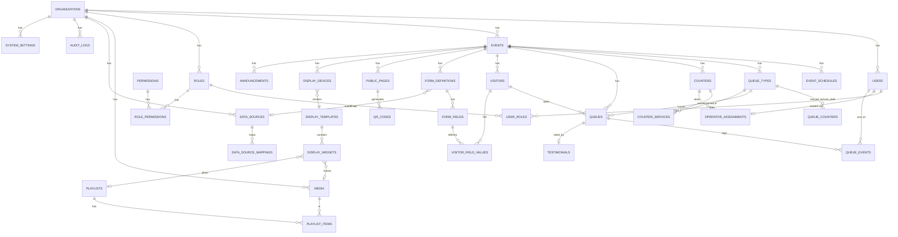

# ANTREAN — Rencana Implementasi

> **"Kelola Antrean. Layani Lebih Cepat."**
> Dokumen ini adalah turunan teknis dari `baca.md` (spesifikasi §1–§60).
> Sumber kebenaran requirement tetap `baca.md`; dokumen ini mengatur **arsitektur, ERD, struktur folder, dan urutan kerja**.

---

## Status Pengerjaan

Terakhir diperbarui: **6 September 2026** (Phase 7 & 8 selesai — seluruh phase tuntas)

| Phase | Status | Catatan |
|---|---|---|
| 0 — Fondasi | ✅ Selesai | Nuxt 4.4 + Prisma 7 + MySQL 26.7, `/api/health` hijau |
| 1 — Auth, RBAC, Event, Queue Type | ✅ Selesai | Better Auth + 42 permission + 4 role sistem, seed idempoten |
| 2 — Public registration, form dinamis, nomor antrean | ✅ Selesai | Form builder, halaman publik + QR, penomoran atomik |
| 3 — Dashboard operator | ✅ Selesai | NEXT/RECALL/SKIP/COMPLETE + pintasan papan tik |
| 4 — Realtime, display, suara | ✅ Selesai | Socket.IO (WS + fallback polling), display 16:9, TTS |
| 5 — Display builder, media, playlist | ✅ Selesai | Unggah tervalidasi magic byte, playlist berdurasi, kanvas 1920×1080 drag & resize + undo/redo |
| 6 — Analytics, laporan, ekspor | ✅ Selesai | 6 chart ECharts, laporan harian siap cetak, ekspor CSV/XLSX latar belakang, audit log berfilter |
| 7 — Testimoni, integrasi data source, konfigurasi | ✅ Selesai | Rating + moderasi, data source terenkripsi + penjaga SSRF, autofill formulir, pengaturan sistem, branding per event, NotificationService, cetak tiket |
| 8 — Pengerasan & rilis | ✅ Selesai | Penjadwal buka/tutup otomatis, header keamanan + CSP, uji beban 2.000 antrean/200 display, DEPLOYMENT.md, seed produksi |

**Audit 5–6 Sep 2026:** seluruh fungsi disapu ulang; 18 temuan (4 bug senyap, 3 metrik keliru,
5 masalah performa, 6 fungsi tak terjangkau UI) sudah diperbaiki dan diverifikasi — rinciannya di
[docs/AUDIT.md](docs/AUDIT.md).

**Terverifikasi (6 September 2026):**

| Lapis | Hasil |
|---|---|
| `npm run test` | 72 test hijau (44 unit + 28 integrasi) |
| `npm run typecheck` · `npx eslint .` | bersih |
| `npm run smoke:api` | 53/53 endpoint |
| `npm run smoke:browser` | 12/12 — termasuk sapuan **21 halaman admin**, pemeriksaan tidak ada halaman placeholder, dan layar penuh display |
| `npm run smoke:phase5` | 11/11 media, playlist, display builder |
| `npm run smoke:phase6` | 13/13 analytics, laporan, ekspor, audit |
| `npm run smoke:phase7` | 30/30 pengaturan, rating, integrasi, autofill, kebocoran data |
| `npm run smoke:phase8` | 13/13 penjadwal, header keamanan, rate limit, unggahan |
| `npm run load-test` | 2.000 antrean (0 gagal) + 200 display tersambung, siaran sampai 200/200 |
| `npm run ux-audit` | 37/37 — fungsi lewat antarmuka, responsif 3 lebar × 22 halaman, kontras WCAG AA, aksesibilitas, umpan balik |

**Acceptance criteria §59: 30/30 terpenuhi.**

### Angka uji beban (dev server, satu instance)

Diukur pada `npm run dev` — bukan build produksi, jadi angkanya batas bawah:

| Metrik | Hasil |
|---|---|
| 200 display pairing + connect | 0,3 detik, 200/200 tersambung |
| 2.000 antrean (25 paralel) | 87,9 detik · 22,8 antrean/detik · 0 gagal · tanpa nomor duplikat |
| Latensi pembuatan antrean | p50 1.123 ms · p95 1.362 ms |
| Panggil NEXT | 142 ms |
| Siaran panggilan sampai ke layar | 200/200 layar · p50 63 ms · p95 68 ms |
| Baca status display saat penuh | p50 83 ms · p95 127 ms |

### Penyesuaian saat implementasi

1. **Prisma 7 wajib memakai driver adapter** — dipasang `@prisma/adapter-mariadb` dengan `timezone: 'Z'`
   supaya DATETIME benar-benar tersimpan UTC meski server MySQL berjalan pada zona Asia/Jakarta.
   Konsekuensinya raw SQL wajib memakai `UTC_TIMESTAMP(3)`, bukan `NOW()`.
2. **Better Auth 1.7 menambah kolom `issuer` pada tabel `account`** beserta unique `(issuer, accountId)` —
   tidak muncul di output CLI versi lama, ditemukan saat seed pertama gagal. Sudah masuk migrasi.
3. **Tombol NEXT sekaligus menutup antrean berjalan** sebagai `COMPLETED` (mencatat `service_seconds`),
   mengikuti tata letak tombol §13. Endpoint `complete` tetap ada untuk penyelesaian eksplisit.
4. **Klien tidak menentukan room WebSocket sendiri.** Server yang memutuskan room dari identitas
   terverifikasi (token publik / device token / cookie sesi), supaya seseorang tidak bisa menguping
   antrean orang lain hanya dengan menebak nama room.
5. **Endpoint aksi operator disatukan** menjadi `POST /api/operator/queue/{id}/{action}` agar aturan izin,
   broadcast, dan audit tidak tercecer di tujuh berkas.
6. **Halaman phase 5–7 sempat dibuat sebagai placeholder** yang menyebut phase-nya, bukan dibiarkan
   404 — navigasi admin tetap utuh sejak awal. Seluruhnya kini sudah berisi; `smoke:browser`
   memeriksa tidak ada lagi halaman yang menampilkan "Bagian ini belum dibangun".
7. **Pengaturan sistem memakai satu katalog** (`shared/constants/settings.ts`) yang dipakai server,
   antarmuka, dan kode fitur sekaligus. Formulir pengaturan dirender otomatis dari katalog itu,
   sehingga menambah satu pengaturan tidak menyentuh tiga berkas yang gampang jadi tidak sinkron.
8. **Sebagian pengaturan boleh ditimpa per event** lewat `events.settings` — satu organisasi bisa
   menjalankan poliklinik dengan batas panggil ulang berbeda tanpa membuat organisasi baru.
9. **Autofill mengembalikan nilai terpetakan saja.** Daftar field yang boleh diisi diambil dari
   definisi formulir aktif, bukan dari pemetaan, sehingga respons pihak ketiga tidak bisa
   menitipkan kunci lain. Diuji langsung: field rahasia di sumber data tidak pernah sampai ke
   pengunjung (`smoke:phase7`).
10. **Status display dihitung saat dibaca**, bukan dipercaya dari kolom `status`. Layar yang dicabut
    kabelnya tidak pernah mengabari siapa pun; kalau kolomnya dipercaya, perangkat mati akan
    selamanya tampak menyala.
11. **Penjadwal berjalan di dalam proses Nitro**, bukan cron sistem, supaya `npm run dev` dan satu
    kontainer produksi sama-sama langsung bekerja. Konsekuensinya harus dimatikan pada instance
    tambahan saat scale-out (`SCHEDULER_ENABLED=false`).
12. **Penutupan harian memakai status `SCHEDULED`, bukan `CLOSED`.** Ditemukan lewat
    `npm run ux-audit`: event demo tertutup otomatis pada malam sebelumnya dan tidak pernah
    terbuka lagi, karena pembukaan otomatis hanya menyentuh event `SCHEDULED`. `CLOSED` kini
    berarti akhir yang sebenarnya — melewati tanggal berakhir, tanpa hari layanan lain, atau
    ditutup admin.
13. **Warna jenis antrean disesuaikan sebelum dipakai sebagai warna teks**
    (`shared/utils/color.ts` + `useReadableColor()`). Warna pilihan admin bisa hanya 2,5:1 di atas
    kartu gelap; helper ini menerangkannya sampai 4,5:1 tanpa mengubah identitas warnanya.
14. **Cakupan operator diturunkan dari LOKET** (§12, §28). Ditemukan saat pengguna menanyakannya:
    panel operator sempat menampilkan tab dari 11 event sekaligus, dan tab terpilih pertama belum
    tentu event yang sedang dikerjakan. Aturan sempat ditambal sebagai pemeriksaan "satu operator
    satu event" di atas struktur lama (`operator_assignments` per jenis antrean), lalu dirombak
    menjadi struktural atas permintaan pengguna: `operator_assignments` kini `UNIQUE(user_id)`
    dengan satu `counter_id`, dan layanan pindah ke tabel baru `counter_services`. Karena loket
    milik satu event, batas event tidak lagi butuh pemeriksaan sendiri — tidak mungkin dilanggar.
    Pemindahan tetap harus eksplisit dan tetap dijaga agar tidak mencabut operator yang sedang
    melayani; loket tanpa layanan tidak bisa ditempati.
15. **Sakelar tema di setiap halaman, dan warna primer per tema.** Diminta pengguna
    setelah panel admin saja yang punya penggantian tema (itu pun tersembunyi di menu
    akun). Sakelarnya satu komponen (`UiThemeToggle`) yang dipasang lewat layout,
    plus langsung pada halaman yang tidak memakai layout (operator, display) dan pada
    `app/error.vue` yang sekaligus menggantikan halaman galat bawaan Nuxt yang
    berbahasa Inggris. Sapuan tema gelap ke lebih banyak halaman langsung menemukan
    dua cacat: `--ui-primary` bernilai sama untuk kedua tema — sehingga teks tombol
    utama di tema gelap hanya 3,3:1 — dan beberapa lencana masih memakai warna
    layanan mentah tanpa `useReadableColor()`.
16. **Layar bisa menampilkan data per loket dan isian formulir pengunjung** (§18, §19).
    Diminta pengguna: satu layanan sering dipegang 2–4 loket, dan papan "nomor dilayani" per
    layanan tidak menjawab "nomor mana di loket mana". Ditambah dua widget — `COUNTER_BOARD`
    (satu kotak per loket) dan `VISITOR_INFO` (nomor + isian formulir, mis. nama). Konsekuensi
    yang disengaja: `GET /api/display/{code}/state` menghitung kunci field dari widget pada
    template, dan HANYA kunci itu yang dikirim ke perangkat — data pengunjung memuat nomor HP
    dan nomor identitas, jadi layar tidak boleh menerima semuanya hanya karena widget-nya ada.
    Label field disalin ke dalam konfigurasi widget saat dipilih, sehingga layar tidak perlu
    memuat definisi formulir dan tampilannya tidak berubah sendiri saat formulir disunting.
17. **Kode app mengimpor folder `shared/` lewat alias `#shared`, bukan jalur relatif.**
    Ditemukan saat `npm run build` pertama kali dijalankan: akar Vite sisi app adalah
    `app/`, jadi impor relatif yang keluar dari akar itu ditandai EXTERNAL dan ditulis
    sebagai `../shared/constants/permissions.ts` ke dalam chunk — Nitro lalu berhenti
    dengan `UNRESOLVED_IMPORT`. Dev tidak pernah memperlihatkannya karena resolusi
    berjalan di Vite, bukan lewat bundel Nitro. 65 impor pada 35 berkas diubah.
18. **Runtime Prisma tidak dibundel & satu barisnya ditambal saat build.** Klien hasil
    generate dibuka dengan `globalThis['__dirname'] = path.dirname(fileURLToPath(import.meta.url))`.
    Di dalam bundel, `import.meta.url` menjadi shim yang pada chunk bernilai
    `file:///_entry.js` — bukan path absolut di Windows, sehingga server hasil build mati
    sebelum melayani satu permintaan pun. `__dirname` itu sendiri tidak terpakai karena
    koneksi memakai driver adapter, jadi nilainya diganti `process.cwd()` lewat plugin
    rollup kecil di `nuxt.config.ts`.
19. **Ikatan label ⇄ input bisa putus HANYA di hasil build.** Pada halaman yang bagian
    formulirnya dirender server lalu dipasang ulang di klien, `useId()` menghasilkan id
    berbeda (`for="v-0-38-4"` vs `id="v-0-0-4"`). Yang paling terasa kolom tanggal:
    tanpa ikatan itu ia kehilangan nama yang bisa dibacakan pembaca layar. Kolom tanggal
    pada Laporan, Pengunjung, dan Rating kini punya `aria-label` sendiri — nama yang tidak
    bergantung pada id mana pun. Ditemukan oleh `ux-audit` yang dijalankan terhadap hasil
    build (`SMOKE_BASE`), bukan terhadap server dev.
20. **Label waktu relatif memakai `useNow()`.** `Date.now()` di dalam render membuat SSR dan
    hidrasi menghasilkan teks berbeda — Vue melaporkannya sebagai mismatch dan membuang DOM
    yang sudah dirender.

---

## 0. Ringkasan Keputusan Arsitektur (ADR singkat)

| # | Keputusan | Alasan | Konsekuensi |
|---|---|---|---|
| 1 | **Nuxt 4 monolit** (app + Nitro server API), bukan backend terpisah | Satu repo, satu deploy, SSR untuk public page & display, auto-import + `shared/` untuk tipe lintas sisi | Realtime harus jalan di proses Nitro yang sama |
| 2 | **Socket.IO** (via engine.io nitro plugin), bukan raw WS/crossws | §44 butuh auto-reconnect + exponential backoff + fallback polling — Socket.IO memberikan itu gratis; konsep *room* cocok untuk kanal display/event/queue-type | Wajib deploy Node server (bukan edge/serverless). Adapter in-memory dulu, Redis adapter saat multi-instance |
| 3 | **MySQL via container yang sudah berjalan** (`festive_kowalevski`, MySQL 26.7) | `mysql` CLI tidak terpasang di mesin ini; container tersebut sudah ada dan dipakai bersama | DB dev `antrean`, DB test `antrean_test` |
| 4 | **Prisma ORM + raw SQL untuk hot path antrean** | Prisma untuk 95% CRUD; `SELECT … FOR UPDATE SKIP LOCKED` (MySQL 8) untuk NEXT queue via `$queryRaw` di dalam `$transaction` | Ada sedikit SQL manual yang wajib ditutup unit test |
| 5 | **ULID (CHAR(26))** sebagai PK di semua tabel | §31; ULID = time-sortable (index-friendly di InnoDB, tidak seburuk UUIDv4) dan aman diekspos | ID di-generate di app layer (`ulid()`), bukan DB default |
| 6 | **Auth: Better Auth 1.7** (sesi cookie httpOnly) + RBAC tabel sendiri | Dipilih user; CSRF check bawaan menolak permintaan tanpa `Origin`. Visitor **tidak** pakai auth — pakai `public_token` opaque (§43) | `BETTER_AUTH_SECRET` wajib; token visitor = 32-byte random base64url |
| 7 | **Waktu: DB simpan UTC**, `service_date` disimpan **DATE** hasil hitung di timezone event | §50 — tanggal layanan harus ikut timezone event, bukan server | Semua penulisan queue lewat `resolveServiceDate(event)` |
| 8 | **Dynamic form: EAV + snapshot JSON** | `visitor_field_values` untuk query/filter/report; `visitors.data` JSON untuk render cepat & tahan perubahan form | Sedikit denormalisasi, disengaja |
| 9 | **Secret datasource: AES-256-GCM** (`APP_ENCRYPTION_KEY`) | §6 melarang plaintext | Key rotation disiapkan lewat kolom `key_version` |
| 10 | **Storage abstraction** (`StorageService`): driver `local` dulu, `s3/minio` menyusul | §20 media library; hindari vendor lock | Upload lewat service, jangan langsung `fs` di handler |
| 11 | **Counter/Loket jadi entitas sendiri** (improvement §58), dan **loket-lah pemilik layanan** | Spec menampilkan "LOKET 1" di display & announcement tapi tidak ada di daftar tabel §30. Layanan diletakkan pada loket (bukan pada operator) supaya satu perubahan berlaku bagi semua operator di loket itu | Tabel `counters` + `counter_services`; `operator_assignments` hanya menghubungkan user → loket |
| 12 | **UI: Nuxt UI v4 + Tailwind v4** | Konsisten, ada Modal/Drawer/Toast/Skeleton/Badge siap pakai (§41) | Display & public page pakai styling custom di atasnya (butuh tampilan non-dashboard) |

---

## 1. ERD

### 1.1 Diagram relasi utama



### 1.2 Tabel & kolom kunci

Konvensi global: PK `id CHAR(26)` (ULID) · `created_at` / `updated_at` di semua tabel · `deleted_at` (soft delete) di tabel penting · semua FK ber-index.

**Tenancy & Auth**

| Tabel | Kolom penting | Index / Constraint |
|---|---|---|
| `organizations` | name, slug, logo_url, timezone (default `Asia/Jakarta`), settings JSON | UNIQUE(slug) |
| `users` | organization_id, email, username, password_hash (argon2id), full_name, phone, avatar_url, is_active, last_login_at | UNIQUE(organization_id, email), UNIQUE(organization_id, username), IDX(organization_id) |
| `roles` | organization_id (NULL = role sistem), key, name, is_system | UNIQUE(organization_id, key) |
| `permissions` | key (`queue.call`, `event.manage`, …), group, description | UNIQUE(key) |
| `role_permissions` | role_id, permission_id | PK(role_id, permission_id) |
| `user_roles` | user_id, role_id | PK(user_id, role_id) |

**Event & Jadwal**

| Tabel | Kolom penting | Index / Constraint |
|---|---|---|
| `events` | organization_id, name, slug, description, status ENUM(DRAFT, SCHEDULED, OPEN, PAUSED, CLOSED, COMPLETED), timezone, start_date, end_date, branding JSON, settings JSON, allow_finish_after_close BOOL | UNIQUE(organization_id, slug), IDX(status) |
| `event_schedules` | event_id, day_of_week 0–6, open_time TIME, close_time TIME, is_closed, override_date DATE NULL (libur / jadwal khusus) | UNIQUE(event_id, day_of_week, override_date) |

**Antrean (inti)**

| Tabel | Kolom penting | Index / Constraint |
|---|---|---|
| `queue_types` | event_id, code, name, description, prefix, starting_number, number_format (`{prefix}{seq:3}`), padding, color, icon, is_active, display_order, max_waiting, est_service_seconds | UNIQUE(event_id, code), IDX(event_id, is_active) |
| `counters` | event_id, code (`L1`), name (`Loket 1`), is_active, display_order | UNIQUE(event_id, code) |
| `queue_counters` | event_id, queue_type_id, service_date DATE, current_number INT | **UNIQUE(event_id, queue_type_id, service_date)** |
| `queues` | organization_id, event_id, queue_type_id, visitor_id, service_date DATE, sequence_number INT, queue_number VARCHAR(32), status ENUM(WAITING, CALLED, SERVING, SKIPPED, COMPLETED, CANCELLED, NO_SHOW), priority INT, public_token CHAR(43), operator_id, counter_id, recall_count, called_at, last_called_at, serving_started_at, finished_at, waiting_seconds, service_seconds, source ENUM(PUBLIC, KIOSK, OPERATOR, API), note, deleted_at | **UNIQUE(event_id, queue_type_id, service_date, sequence_number)**, UNIQUE(public_token), **IDX(event_id, queue_type_id, service_date, status, sequence_number)** ← dipakai NEXT, IDX(operator_id), IDX(service_date), IDX(created_at) |
| `queue_events` | queue_id, event_type, previous_status, new_status, operator_id, metadata JSON, created_at | IDX(queue_id, created_at) |
| `operator_assignments` | user_id, counter_id | UNIQUE(user_id) → satu operator satu loket, IDX(counter_id) |
| `counter_services` | counter_id, queue_type_id, display_order | UNIQUE(counter_id, queue_type_id), IDX(queue_type_id) |

**Visitor & Form Dinamis**

| Tabel | Kolom penting | Index / Constraint |
|---|---|---|
| `visitors` | organization_id, event_id, full_name, phone, email, identity_number, data JSON (snapshot form), ip_address, user_agent | IDX(event_id, created_at), IDX(phone), IDX(identity_number) |
| `form_definitions` | event_id, name, description, version, is_active, datasource_id NULL | IDX(event_id, is_active) |
| `form_fields` | form_definition_id, label, key, type ENUM(TEXT, TEXTAREA, NUMBER, PHONE, EMAIL, DATE, DATETIME, SELECT, RADIO, CHECKBOX, FILE, HIDDEN), placeholder, help_text, is_required, validation JSON, default_value, options JSON, display_order, visibility JSON (conditional), autofill_key | UNIQUE(form_definition_id, key) |
| `visitor_field_values` | visitor_id, form_field_id, field_key, value_text, value_number, value_date, value_json | IDX(visitor_id), IDX(field_key, value_text(64)) |

**Integrasi Eksternal**

| Tabel | Kolom penting | Index / Constraint |
|---|---|---|
| `data_sources` | organization_id, name, type ENUM(REST, JSON, DB_READONLY, WEBHOOK), base_url, http_method, auth_type ENUM(NONE, API_KEY, BEARER, BASIC), credentials_cipher BLOB, key_version, headers JSON, query_template JSON, timeout_ms, is_active | IDX(organization_id, is_active) |
| `data_source_mappings` | data_source_id, source_path (`$.data.name`), target_field_key, transform | IDX(data_source_id) |

**Public & QR**

| Tabel | Kolom penting | Index / Constraint |
|---|---|---|
| `public_pages` | event_id, publish_code, slug, title, subtitle, description, logo_url, background_url, theme JSON (warna/font/CSS var), is_published, allowed_queue_type_ids JSON, require_captcha, max_per_ip_per_day, info_html (sanitized) | UNIQUE(publish_code), UNIQUE(slug) |
| `qr_codes` | public_page_id, code, target_url, version, png_path, svg_path, is_active | IDX(public_page_id, is_active) |

**Display**

| Tabel | Kolom penting | Index / Constraint |
|---|---|---|
| `display_devices` | event_id, device_code, device_token_hash, name, type ENUM(GLOBAL, QUEUE_TYPE), queue_type_id NULL, template_id, status ENUM(UNPAIRED, ONLINE, OFFLINE), last_seen_at, last_ip | UNIQUE(device_code) |
| `display_templates` | organization_id, event_id NULL, name, type, canvas_width (1920), canvas_height (1080), background JSON, settings JSON (audio/TTS), is_default | IDX(organization_id, type) |
| `display_widgets` | template_id, type ENUM(CURRENT_QUEUE, QUEUE_LIST, CLOCK, DATE, LOGO, IMAGE, VIDEO, TEXT, RUNNING_TEXT, ANNOUNCEMENT, ORG_NAME, QRCODE, PLAYLIST, HTML), x, y, width, height, z_index, config JSON, style JSON, animation, is_visible | IDX(template_id, z_index) |
| `media` | organization_id, name, type ENUM(IMAGE, VIDEO), mime, file_path, size_bytes, width, height, duration_seconds, thumbnail_path, is_active, uploaded_by | IDX(organization_id, type) |
| `playlists` / `playlist_items` | name, is_active / playlist_id, media_id, display_order, duration_seconds | IDX(playlist_id, display_order) |
| `announcements` | event_id, title, message, type ENUM(TEXT, RUNNING_TEXT), priority, starts_at, ends_at, is_active | IDX(event_id, is_active, starts_at) |

**Feedback, Audit, Sistem**

| Tabel | Kolom penting | Index / Constraint |
|---|---|---|
| `testimonials` | queue_id, visitor_id, event_id, rating 1–5, comment, is_approved, approved_by, approved_at | UNIQUE(queue_id), IDX(event_id, is_approved) |
| `audit_logs` | organization_id, user_id NULL, action, entity, entity_id, old_data JSON, new_data JSON, ip_address, user_agent, created_at | IDX(organization_id, created_at), IDX(entity, entity_id) |
| `system_settings` | organization_id, key, value JSON, updated_by | UNIQUE(organization_id, key) |
| `notifications` | organization_id, user_id NULL, channel ENUM(DISPLAY, BROWSER, EMAIL, WHATSAPP, SMS), type, payload JSON, status, sent_at, error | IDX(status, created_at) |
| `export_jobs` *(improvement)* | requested_by, type, filters JSON, format ENUM(CSV, XLSX, PDF), status, file_path, row_count, error | IDX(requested_by, created_at) |

### 1.3 Aturan integritas yang wajib ditegakkan DB (bukan cuma app)

1. `UNIQUE(event_id, queue_type_id, service_date, sequence_number)` → mustahil ada nomor ganda (§57.3).
2. `UNIQUE(event_id, queue_type_id, service_date)` di `queue_counters` → satu counter per hari per layanan (§32).
3. `UNIQUE(queue_id)` di `testimonials` → satu rating per antrean.
4. `UNIQUE(public_token)` di `queues` → token tracking tak bertabrakan (§43).
5. FK `ON DELETE RESTRICT` untuk `queues` (§57.13: jangan hard delete, pakai CANCELLED / `deleted_at`).

### 1.4 Dua algoritma kritikal

**A. Generate nomor antrean (§32)** — di dalam satu `$transaction`:

```sql
INSERT INTO queue_counters (id, event_id, queue_type_id, service_date, current_number, ...)
VALUES (?, ?, ?, ?, @start)
ON DUPLICATE KEY UPDATE current_number = current_number + 1;

SELECT current_number FROM queue_counters
 WHERE event_id = ? AND queue_type_id = ? AND service_date = ? FOR UPDATE;
-- format nomor dari queue_types.number_format → INSERT ke queues
```

Tidak pernah `MAX(sequence) + 1`. Kalau INSERT `queues` gagal karena unique violation → retry maksimum 3×.

**B. NEXT queue anti double-call (§14, §57.4)** — `$transaction`, isolation default REPEATABLE READ:

```sql
SELECT id FROM queues
 WHERE event_id = ? AND queue_type_id = ? AND service_date = ? AND status = 'WAITING'
 ORDER BY priority DESC, sequence_number ASC
 LIMIT 1
 FOR UPDATE SKIP LOCKED;      -- MySQL 8: operator lain langsung lompat ke baris berikutnya

UPDATE queues SET status = 'CALLED', operator_id = ?, counter_id = ?,
       called_at = NOW(3), last_called_at = NOW(3),
       waiting_seconds = TIMESTAMPDIFF(SECOND, created_at, NOW())
 WHERE id = ? AND status = 'WAITING';   -- guard status, wajib affectedRows = 1

INSERT INTO queue_events (...);
```

Broadcast WebSocket dilakukan **setelah** commit, bukan di dalam transaksi.

---

## 2. Struktur Folder

```
antrean/
├─ app/                              # Nuxt 4 app layer
│  ├─ assets/css/{main.css,display.css}
│  ├─ components/
│  │  ├─ ui/                         # wrapper Nuxt UI: StatCard, PageHeader, ConfirmDialog, EmptyState
│  │  ├─ admin/                      # tabel, filter, form CRUD
│  │  ├─ charts/                     # wrapper ECharts (client-only)
│  │  ├─ operator/                   # NowServingPanel, WaitingList, SkippedList, ActionBar
│  │  ├─ display/
│  │  │  ├─ widgets/                 # 1 komponen per tipe widget (auto-registry)
│  │  │  └─ DisplayRenderer.vue      # render template → widget absolut, skala 1920x1080
│  │  ├─ display-builder/            # kanvas drag & drop, panel properti, layer list
│  │  ├─ form-builder/               # palette field, kanvas, panel properti
│  │  └─ public/                     # TakeQueueCard, QueueTicket, RatingForm
│  ├─ composables/
│  │  ├─ useSocket.ts                # koneksi + status reconnect
│  │  ├─ useQueueRealtime.ts         # subscribe room, patch state
│  │  ├─ useSpeech.ts                # Web Speech API (§22)
│  │  ├─ useAuth.ts  useCan.ts       # session + pengecekan permission
│  │  └─ useApi.ts                   # wrapper $fetch + format response standar
│  ├─ layouts/{default,auth,admin,operator,display,public}.vue
│  ├─ middleware/{auth.ts,guest.ts,permission.ts}
│  ├─ pages/
│  │  ├─ index.vue                 login.vue
│  │  ├─ p/[publishCode].vue       # ambil antrean
│  │  ├─ queue/[token].vue         # tracking visitor
│  │  ├─ display/[displayCode]/index.vue
│  │  ├─ display/[displayCode]/queue/[queueTypeCode].vue
│  │  ├─ display/connect/[deviceCode].vue
│  │  ├─ operator/{index,queue,history}.vue
│  │  └─ admin/
│  │     ├─ dashboard.vue  analytics.vue
│  │     ├─ events/{index,[id]}.vue     queue-types/…    counters/…
│  │     ├─ live-queue.vue   queue-history.vue
│  │     ├─ visitors/…       feedback.vue
│  │     ├─ operators/…      roles.vue    assignments.vue
│  │     ├─ forms/…          public-pages/…
│  │     ├─ displays/…       display-builder/[templateId].vue    media.vue
│  │     ├─ integrations/…   reports/…    settings.vue    audit-logs.vue
│  ├─ plugins/{socket.client.ts,echarts.client.ts}
│  ├─ stores/{auth,operator,display}.ts
│  └─ utils/{format.ts,datetime.ts,queue.ts}
│
├─ server/
│  ├─ api/
│  │  ├─ auth/{login,logout,me}.post.ts
│  │  ├─ public/[publishCode]/{index.get,queue.post,status.get}.ts
│  │  ├─ public/queue/[token]/{index.get,rating.post}.ts
│  │  ├─ operator/queue/{index.get,next.post,[id]/{recall,skip,complete,call}.post.ts}
│  │  ├─ display/{connect.post,[deviceCode]/state.get}.ts
│  │  └─ admin/…                       # satu folder per resource, REST konsisten
│  ├─ middleware/{01.request-context.ts,02.rate-limit.ts,03.auth-context.ts}
│  ├─ plugins/socket.ts                # engine.io + Socket.IO di-bind ke Nitro
│  ├─ realtime/{rooms.ts,emitters.ts,handlers.ts}
│  ├─ services/                        # business logic (queue, event, display, export…)
│  ├─ repositories/                    # akses Prisma; hot path pakai $queryRaw
│  ├─ jobs/{auto-close.ts,export.ts,display-heartbeat.ts}   # scheduler
│  └─ utils/{prisma.ts,crypto.ts,response.ts,error.ts,logger.ts,audit.ts,storage.ts,permission.ts}
│
├─ shared/                             # auto-import di app & server (Nuxt 4)
│  ├─ types/          enums/           # QueueStatus, EventStatus, WidgetType…
│  ├─ schemas/                         # Zod: satu skema dipakai form & API
│  └─ constants/                       # PERMISSIONS, SOCKET_EVENTS, ROOMS
│
├─ prisma/{schema.prisma,migrations/,seed.ts}
├─ tests/
│  ├─ unit/{queue-number,service-date,permission,format}.spec.ts
│  ├─ integration/{queue-concurrency,daily-reset,operator-authz,public-registration}.spec.ts
│  └─ e2e/{take-queue,operator-flow,display-realtime}.spec.ts   # Playwright
├─ docs/{API.md,WEBSOCKET.md,ERD.md,DEPLOYMENT.md}
├─ storage/uploads/                    # driver lokal (gitignored)
├─ docker-compose.yml                  # mysql8 + adminer (+ redis opsional)
├─ .env.example   README.md   phase.md   baca.md
└─ nuxt.config.ts  tsconfig.json  eslint.config.mjs  vitest.config.ts
```

**Aturan lapisan (§55)** — arah ketergantungan satu arah, tidak boleh dilangkahi:

```
page/component → composable → server/api (handler tipis) → service → repository → prisma
                                        ↘ validation (zod) ↗
```

Handler API hanya boleh: validasi input → panggil service → bungkus response. Nol query Prisma di dalam handler, nol business logic di dalam `.vue`.

**Format response seragam (§56)** — helper `ok(data, message)` dan `fail(code, message, status)` di `server/utils/response.ts`, plus error handler global yang memetakan `AppError` → HTTP status.

---

## 3. Kanal Realtime (§35)

| Room | Subscriber | Event yang diterima |
|---|---|---|
| `event:{eventId}` | display global, admin live-queue | `queue.*`, `event.opened`, `event.closed`, `announcement.created` |
| `queue-type:{queueTypeId}` | display per layanan, dashboard operator | `queue.called`, `queue.recalled`, `queue.completed`, `queue.skipped` |
| `queue:{publicToken}` | halaman tracking visitor | `queue.called`, `queue.updated`, posisi antrean |
| `display:{deviceId}` | satu perangkat display | `display.updated`, `display.reload`, perintah pairing |
| `admin:{organizationId}` | dashboard admin | agregat statistik, `audit.created` |

Emit selalu **setelah commit** DB, lewat `server/realtime/emitters.ts` (satu fungsi per event, payload bertipe di `shared/types/socket.ts`). Klien display jatuh ke polling `GET /api/display/{code}/state` tiap 10 detik jika socket putus (§44).

---

## 4. Urutan Kerja

Estimasi = hari kerja efektif satu developer, kasar.

### PHASE 0 — Fondasi *(≈1–2 hari)*

Belum ada di §54, tapi wajib duluan supaya phase berikutnya tidak berdarah-darah.

- `npx nuxi init`, TypeScript strict, ESLint, Tailwind v4 + Nuxt UI, Vitest.
- `docker-compose.yml`: MySQL 8 (`--default-time-zone=+00:00`) + Adminer.
- `.env.example`: `DATABASE_URL, APP_URL, API_BASE_URL, SESSION_SECRET, APP_ENCRYPTION_KEY, STORAGE_DRIVER, STORAGE_LOCAL_PATH, S3_*, SMTP_*, DEFAULT_TIMEZONE, RATE_LIMIT_*, TURNSTILE_*`.
- Utilitas inti: `prisma.ts`, `response.ts`, `error.ts` (AppError + katalog kode error), `logger.ts`, `datetime.ts` (Day.js + plugin utc/timezone), `ulid.ts`, `crypto.ts` (AES-256-GCM).
- Layout kosong + halaman placeholder supaya routing sudah terbentuk.
- **DoD:** `npm run dev` jalan, `/api/health` mengembalikan format response standar, `docker compose up -d` menyalakan DB.

### PHASE 1 — Auth, RBAC, Organization, Event, Queue Type *(≈4–5 hari)* — §54 Phase 1

- `schema.prisma` **lengkap semua tabel** sekaligus (hindari 20 migration receh), migration awal, `prisma/seed.ts` (§51: Demo Organization, Demo Service, queue type A/B/C, superadmin + operator1 + operator2, warning ganti password).
- Katalog permission di `shared/constants/permissions.ts`; role sistem `SUPERADMIN`, `ADMIN`, `OPERATOR`, `VIEWER`.
- Login (`/login`), session cookie, middleware `auth`/`permission`, redirect per role (§52).
- CRUD Event + `event_schedules` (jam operasional per hari + override tanggal), transisi status OPEN/PAUSED/CLOSED.
- CRUD Queue Type (prefix, `number_format`, warna, ikon, urutan) + CRUD Counter/Loket.
- Audit log helper aktif sejak sekarang (setiap service penting memanggil `audit()`).
- **DoD:** AC §59.1–§59.3; unit test permission resolver; login superadmin & operator sampai ke halaman masing-masing.

### PHASE 2 — Public Registration, Form Dinamis, Nomor Antrean *(≈5–6 hari)* — §54 Phase 2

- Form builder admin (drag & drop urutan field, 12 tipe field, validasi, opsi, conditional visibility) → `form_definitions` + `form_fields`.
- Public page builder: publish code, slug kustom, judul/logo/warna/background/info, pilih queue type yang tampil, publish/unpublish.
- QR Code: generate, regenerate (dengan versioning), tampil, download PNG/SVG, print.
- Halaman `/p/[publishCode]`: render form dari definisi, validasi Zod yang di-generate dari `form_fields`, cek status buka/tutup (§10) memakai timezone event.
- `QueueNumberService` (algoritma §1.4-A) + `resolveServiceDate()` + `public_token`.
- Halaman `/queue/[token]`: nomor, status, yang sedang dilayani, posisi antrean, estimasi waktu (rata-rata service time × jumlah di depan), tombol refresh (realtime menyusul di Phase 4).
- Rate limit + Turnstile opsional pada endpoint registrasi (§36).
- **DoD:** AC §59.5–§59.10, §59.27, §59.29; integration test *daily reset* dan *duplicate number*.

### PHASE 3 — Dashboard Operator *(≈4 hari)* — §54 Phase 3

- Penempatan operator → loket, dan layanan loket (`counter_services`).
- `GET /api/operator/queues` (hanya assignment miliknya, §57.5).
- Aksi: NEXT (algoritma §1.4-B), RECALL (`recall_count`, `last_called_at`, batas `recall_limit`), SKIP, COMPLETE, CALL-specific (termasuk memanggil ulang yang SKIPPED §57.7), CANCEL/NO_SHOW.
- Guard transisi status di `QueueStateMachine` (§57.8, §57.9) — satu tempat, dipakai semua endpoint.
- `queue_events` terisi otomatis di setiap transisi (§16).
- UI operator: layar besar, tombol tebal, keyboard shortcut (N/R/S/C), dialog konfirmasi untuk aksi destruktif, panel WAITING / SKIPPED / HISTORY.
- **DoD:** AC §59.11–§59.15, §59.28; integration test 10 operator paralel menekan NEXT → nol nomor ganda.

### PHASE 4 — Realtime, Display, Suara *(≈5 hari)* — §54 Phase 4

- Nitro plugin Socket.IO + auth handshake (session admin/operator, `device_token` display, `public_token` visitor).
- Room & emitter sesuai §3; event `queue.*` lengkap.
- Display device: registrasi, pairing `/display/connect/[deviceCode]`, heartbeat `last_seen_at`, badge ONLINE/OFFLINE + LAST UPDATE, reconnect exponential backoff, fallback polling (§44, §45).
- Display global `/display/[displayCode]` (grid semua layanan) & display per layanan.
- Announcement: highlight + animasi + chime + TTS Web Speech API dengan antrean ucapan (§21, §22) serta pengaturan bahasa/suara/volume/pengulangan.
- Halaman visitor & operator ikut realtime; live-queue admin.
- **DoD:** AC §59.16–§59.18; e2e Playwright: operator NEXT → display berubah < 1 detik tanpa refresh.

### PHASE 5 — Display Builder, Media, Playlist *(≈5–6 hari)* — §54 Phase 5

- Media library: upload (validasi MIME + magic byte + ukuran), thumbnail, durasi video, `StorageService`.
- Playlist + item berdurasi.
- Display builder: kanvas 1920×1080 dengan snap grid, drag/resize, z-index, panel properti per widget, layer list, undo/redo, preview, duplicate template.
- Registry widget: `CURRENT_QUEUE, QUEUE_LIST, CLOCK, DATE, LOGO, IMAGE, VIDEO, TEXT, RUNNING_TEXT, ANNOUNCEMENT, ORG_NAME, QRCODE, PLAYLIST, HTML(sanitized)`.
- `DisplayRenderer` dipakai bersama oleh builder-preview dan display sungguhan (satu komponen, dua mode).
- **DoD:** AC §59.19, §59.20.

### PHASE 6 — Dashboard, Analytics, Report, Export *(≈4 hari)* — §54 Phase 6

- Agregasi metrik (§24): total visitor/queue, completed/waiting/skipped/cancelled, rata-rata waiting & service, satisfaction.
- Chart ECharts (§25) + filter tanggal/event/queue type/operator.
- Laporan harian, laporan operator, laporan antrean.
- Export CSV/XLSX (+PDF untuk laporan harian) lewat `export_jobs`; job besar berjalan async lalu tersedia untuk diunduh.
- Halaman audit log dengan filter.
- **DoD:** AC §59.21–§59.23, §59.25, §59.26.

### PHASE 7 — Testimonial, Integrasi Data Source, Konfigurasi Lanjutan *(≈4–5 hari)* — §54 Phase 7

- Rating & testimoni setelah COMPLETED (§23) + moderasi admin (approve/hide/delete/filter/export).
- Data source: CRUD, kredensial terenkripsi, tombol *test connection*, mapping response → field form, timeout, allowlist host + blokir IP privat (anti-SSRF), tanpa SQL arbitrer (§6).
- Autofill di public form (contoh: input nomor RM → data terisi otomatis).
- System settings (§49) + branding per event/public page (§48).
- Abstraksi `NotificationService` (display + browser dulu, email/WA/SMS sebagai driver kosong) (§47).
- Cetak tiket via browser print, arsitektur disiapkan untuk thermal printer (§46).
- **DoD:** AC §59.24, §59.30.

### PHASE 8 — Pengerasan & Rilis *(≈3 hari)*

- Job auto-close/auto-open terjadwal (§10) + opsi "operator boleh menyelesaikan antrean berjalan".
- Secure headers, CSRF, rate limit menyeluruh, audit celah upload.
- Uji beban ringan: 200 display terhubung + 2.000 antrean/hari.
- Dokumentasi: `README` (instalasi, setup DB, akun demo), `docs/API.md`, `docs/WEBSOCKET.md`, `docs/DEPLOYMENT.md`.
- Seed produksi minimal + checklist ganti password.
- **DoD:** seluruh 30 AC §59 tercentang; `npm install && npm run dev` jalan dari repo bersih.

---

## 5. Peta Test (§60.11–14)

| Berkas | Menguji |
|---|---|
| `tests/integration/queue-concurrency.spec.ts` | 20 request `POST /queue` paralel → 20 nomor berurutan tanpa duplikat; 10 operator NEXT paralel → tidak ada antrean dipanggil dua kali |
| `tests/integration/daily-reset.spec.ts` | Antrean H dan H+1 sama-sama mulai dari 001; histori H tetap utuh; `service_date` dihitung di timezone event, bukan timezone server |
| `tests/integration/operator-authz.spec.ts` | Operator A tidak bisa NEXT/melihat antrean layanan B; operator tidak bisa akses endpoint admin; superadmin bisa semua |
| `tests/integration/public-registration.spec.ts` | Event CLOSED menolak antrean baru; di luar jam layanan ditolak; rate limit aktif; field wajib divalidasi; public page unpublished → 404 |
| `tests/unit/ssrf.spec.ts` | Penjaga permintaan keluar: skema, kredensial di URL, alamat privat & metadata cloud, daftar host, host tak teresolusi |
| `tests/unit/data-source-mapping.spec.ts` | Pembacaan path JSON, transform nilai, dan pemetaan respons → field formulir |
| `tests/unit/settings-ticket.spec.ts` | Katalog pengaturan (nilai bawaan, penjepitan rentang, nilai tak masuk akal) dan tata letak tiket termal |

Integration test memakai MySQL Docker terpisah (`antrean_test`) dengan `prisma migrate deploy` + truncate antar test — bukan mock, karena yang justru diuji adalah perilaku locking database.

---

## 6. Penyimpangan / Improvement dari Spec (§58)

1. **Tabel `counters`** ditambahkan — spec menampilkan "LOKET 1" tetapi tidak punya entitasnya.
2. **`visitors.data` JSON snapshot** mendampingi EAV — render cepat & tahan perubahan definisi form.
3. **`export_jobs`** ditambahkan — §38 mensyaratkan background job, jadi butuh state yang tersimpan.
4. **`qr_codes` diversikan** ketimbang ditimpa — regenerate harus bisa diaudit.
5. **`event_schedules.override_date`** — jadwal libur/khusus tanpa merusak pola mingguan.
6. **`queues.priority`** — antrean prioritas (lansia/disabilitas) sering diminta di layanan publik; kolomnya disiapkan sejak awal walau UI-nya menyusul.
7. **`SKIP LOCKED`** dipilih ketimbang `FOR UPDATE` biasa — operator paralel tidak saling menunggu.
8. **Socket.IO** ketimbang WS mentah — §44 (reconnect + backoff + fallback polling) jadi gratis.
9. **Penjaga SSRF sendiri** (`server/utils/ssrf.ts`) untuk §6: nama host diresolusi lalu ALAMAT
   hasilnya yang diperiksa. Pemeriksaan berbasis teks host gampang dilewati domain yang sengaja
   diarahkan ke 127.0.0.1. Alamat metadata cloud (169.254.0.0/16) tetap diblokir bahkan ketika
   kelonggaran host privat untuk pengembangan dinyalakan.
10. **Redirect tidak diikuti** saat memanggil sumber data. Server jahat cukup menjawab
    `302 Location: http://127.0.0.1:6379` untuk membatalkan seluruh pemeriksaan alamat.
11. **Kata sandi seed produksi diacak** dan hanya dicetak sekali. Kata sandi tetap di dalam
    repositori adalah cara paling umum sebuah instalasi baru langsung bisa dimasuki orang lain.
12. **Ekspor `TESTIMONIALS`** ditambahkan ke pusat ekspor — §23 meminta testimoni bisa diekspor,
    dan membuat jalur ekspor terpisah hanya akan menduplikasi antrean pekerjaan yang sudah ada.

---

## 7. Keputusan yang Sudah Diambil

1. **MySQL dev** — memakai container MySQL 26.7 yang sudah berjalan di mesin ini (`festive_kowalevski`,
   port 3306, database `antrean`), bukan container baru. Database test terpisah: `antrean_test`.
2. **UI** — Nuxt UI v4 + Tailwind v4, dengan palet brand sendiri (`--color-brand-*`) dan komponen
   pembungkus `UiPageHeading`, `UiEventPicker`, `UiComingSoon`.
3. **Auth** — Better Auth 1.7 (email/password, sesi cookie) dipadukan dengan tabel RBAC sendiri
   (`roles`, `permissions`, `role_permissions`, `user_roles`), bukan plugin admin bawaan.
4. **Deploy** — lokal dulu (`npm run dev`), tetapi UI dan fungsionalitas dibangun setara produksi.
   Socket.IO menempel pada proses Nitro, jadi target deploy nanti tetap harus server Node.
5. **Cakupan** — *vertical slice* Phase 0–4 dikerjakan lebih dulu dan sudah selesai; Phase 5–8 menyusul.

## 8. Langkah Berikutnya

Seluruh Phase 0–8 selesai dan 30/30 acceptance criteria §59 terpenuhi. Yang tersisa bukan lagi
pekerjaan phase, melainkan keputusan operasional saat sistem benar-benar dipasang:

1. **Pemasangan pertama** — ikuti [docs/DEPLOYMENT.md](docs/DEPLOYMENT.md), pakai `npm run db:seed:prod`,
   lalu tuntaskan checklist pasca-seed (ganti kata sandi, buat admin harian, atur zona waktu).
2. **Bila nanti lebih dari satu instance** — pasang Redis adapter Socket.IO, pindahkan rate limit
   ke Redis, dan nyalakan penjadwal hanya pada satu instance.
3. **Kanal notifikasi tambahan** — driver EMAIL/WHATSAPP/SMS sudah terdaftar di
   `server/services/notification.service.ts` tetapi sengaja gagal dengan alasan jelas selama belum
   dikonfigurasi. Menambah kanal berarti menulis satu driver, bukan mengubah pemanggilnya.
4. **Printer termal** — isi tiket sudah dipisahkan dari cara mencetaknya
   (`shared/utils/ticket.ts`); `renderTicketText()` menghasilkan tata letak kolom-tetap yang
   tinggal diteruskan sebagai perintah ESC/POS.
5. **Retensi data** — `queues`, `queue_events`, `audit_logs`, dan `notifications` tumbuh terus.
   Belum ada penghapusan otomatis, dan itu disengaja: kebijakan arsip berbeda tiap instansi.
